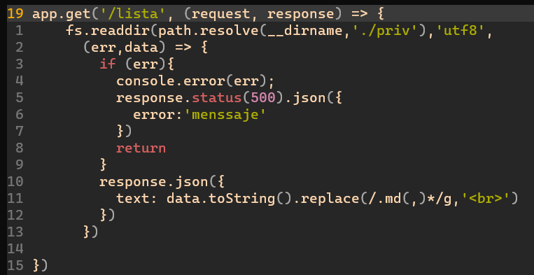
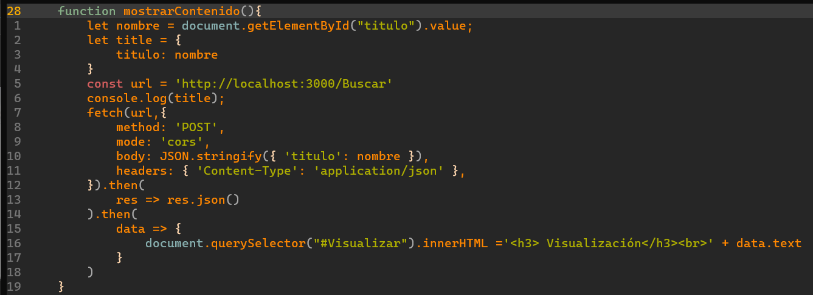
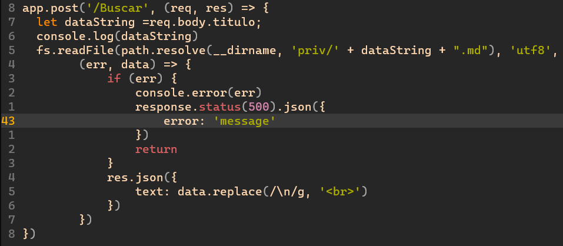
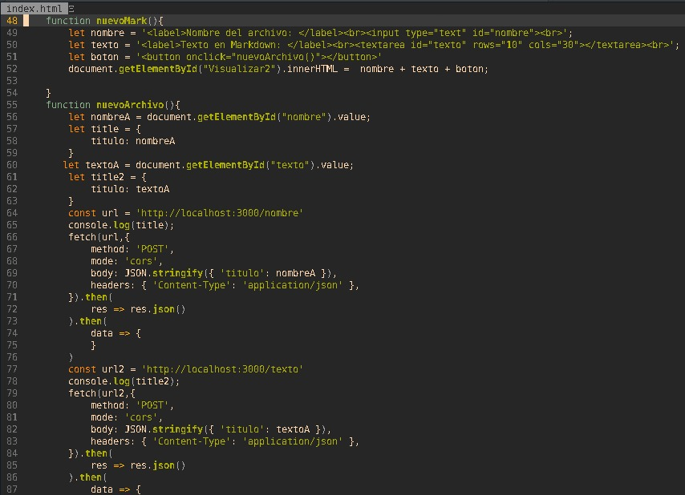
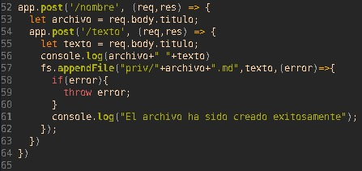

<table>
    <theader>
        <tr>
            <td></td>
            <th>
                UNIVERSIDAD NACIONAL DE SAN AGUSTIN 
                FACULTAD DE INGENIERÍA DE PRODUCCIÓN Y SERVICIOS 
                ESCUELA PROFESIONAL DE INGENIERÍA DE SISTEMAS
            </th>
            <td></td>
        </tr>
    </theader>
    <tbody>
        <tr><td colspan="3">Formato: Guía de Práctica de Laboratorio</td></tr>
        <tr><td>Aprobación:  2022/03/01</td><td>Código: GUIA-PRLD-001</td><td>Página: 1</td></tr>
    </tbody>
</table>

 <h3>INFORME DE LABORATORIO</h3>

<table>
 <theader>
  <tr><th colspan="6" bgcolor="red">INFORMACIÓN BÁSICA</th></tr>
 </theader>
 <tbody>
  <tr><td>ASIGNATURA:</td><td colspan="5">Programación Web 2</td></tr>
  <tr><td>TÍTULO DE LA PRACTICA:</td><td colspan="5">Ajax y NodeJS</td></tr>
  <tr><td>NÚMERO DE PRÁCTICA:</td><td>Practica de Laboratorio 03</td><td>AÑO LECTIVO:</td><td>2022 A</td><td>NRO. SEMESTRE:</td><td>III</td></tr>
  <tr><td>FECHA DE PRESENTACIÓN:</td><td>16/05/2022</td><td>HORA DE PRESENTACIÓN:</td><td colspan="3">10:30 p.m.</td></tr>
  <tr><td>INTEGRANTES:</td><td colspan="3">- Edson Joel López Quispe - Gabriel Steven Machicao Quispe - Fernando Coyla Alvarez</td><td>NOTA:</td><td>...</td></tr>
  <tr><td>DOCENTE:</td><td colspan="5">Richart Smith Escobedo Quispe - rescobedoq@unsa.edu.pe</td></tr>
 </tbody>
</table>
<table>
 <theader>
  <tr><th>SOLUCIÓN Y RESULTADOS</th></tr>
 </theader>
 <tbody>
     <tr><td>I. SOLUCIÓN DE EJERCICIOS/PROBLEMAS: 
Se pone imagen:

      
       
 Aquí se crea el app.get que lée un directorio para luego sacar una data y esta convertirlo a string y luego usar expresiones regulares para sacarle el ".md" y la ",".

         
Por consiguiente se muestra la función mostrarContenido()

         
         
 En esta función se uso un fecth post con el contenido en JSON, pero envia el dato como string y no como objeto, también se aplica el cors para acceder a los datos

          
         
 En el servidor se coloca:

         
         
Se crea un app.post, que recibe dicho contenido anterior para almcenarlo en una variable y concaterla para el readFile y busque el archivo "md" y enviar el contenido como respuesta al cliente.

         
Para la creación del archivo se uso el siguiente código: 

         
         
Aquí se crea una función nuevoMark, para crear en una sección donde introducir los datos para crear el markdown y luego la función nuevoArchivo(), con doble post que envia por partes el titulo y el contenido del nuevo Markdown.

         
Por lado del servidor

         
         
 Se usa también ambos post para reciber los datos en variables y crear el nuevo archivo "md" en el servidor; imprimiendo en la consola una imagen para confirmar la creación.

      </td></tr>
  <tr><td>II. SOLUCIÓN DEL CUESTIONARIO: <strong><em>1. En el Ejemplo "Hola Mundo" con NodeJS. ¿Qué pasó con la línea: "Content type ….."?</em></strong> 
En el primer ejemplo se puede ver que solo imprime en la consola y envia el mensaje al servidor, por cuál este no fue declarado un Content Type, puesto que el ejemplo aun requirio algun archivo en específico.
<strong><em> 2. En los ejercicios. ¿En qué lugar debería estar el archivo poema.txt?</em></strong>
 Debería estar en la url indicada por el path.resolve, pero se recomienda que ese tipo de información se guardára en una carpeta privada, y esta carpeta debe encontrarse en el mismo lugar donde se encuentra el index.js que genera el servidor para su facil generación de rutas relativas.
<strong><em> 3. ¿Entiende la expresión regular en el código y se da cuenta de para qué es útil?</em></strong>
Si se entiende que la expresión regular busca el "\n" en el archivo para luego realizar una acción que determinamos; la importancia de este, es fundamental para trabajar con la información y el manejo de datos.

   <strong><em>4. Note que la respuesta del servidor está en formato JSON, ¿Habrá alguna forma de verla directamente?</em></strong>
Se puede visualizar esa respuesta en el formato JSON, a través de un console.log para ver la información en la consola; se puede evidenciar támbien que se trata de un formato JSON, si al momento de trabjar con este la página web no se recarga.

</td></tr>
  <tr><td>III. CONCLUSIONES:  Se concluye que a través de un servidor se puede obtener datos que el cliente necesite, a traves de las funciones de JavaScript y el de AJAX, para que la página se vuelva dinámica con la ayuda de nodejs y el uso de paquetes express que nos brinda bastantes funcionalidades para que el servidor pueda acceder a funcionalidades bastantes eficiente al momento de usar el servidor.</td></tr>
 </tbody>
</table>

<table>
 <theader>
  <tr><td>RETROALIMENTACIÓN GENERAL</td><tr>
 </theader>
 <tbody>
  <tr><td>...</td></tr>
 </tbody>
</table>

<table>
 <theader>
  <tr><td>REFERENCIAS Y BIBLIOGRAFÍA</td><tr>
 </theader>
 <tbody>
  <tr><td>[1] Uso de Fetch - Referencia de la API Web | MDN. (s. f.). MDN Web Docs. https://developer.mozilla.org/es/docs/Web/API/Fetch_API/Using_Fetch
       [2] Express - Infraestructura de aplicaciones web Node.js. (s. f.). Express - Node.js web application framework. https://expressjs.com/es/
       [3] JavaScript Fetch API. (s. f.). W3Schools Online Web Tutorials. https://www.w3schools.com/js/js_api_fetch.asp
       [4] Getting Started Guide | Node.js. (s. f.). Node.js. https://nodejs.org/en/docs/guides/getting-started-guide/
       [5] Fetch post a api no funciona bien. (s. f.). Stack Overflow en español. https://es.stackoverflow.com/questions/350958/fetch-post-a-api-no-funciona-bien [6] ¿Como listar directorios que cumplan con un patrón de texto o expresión regular? (s. f.). Stack Overflow en español. https://es.stackoverflow.com/questions/168329/como-listar-directorios-que-cumplan-con-un-patrón-de-texto-o-expresión-regular</td></tr>
 </tbody>
</table>
